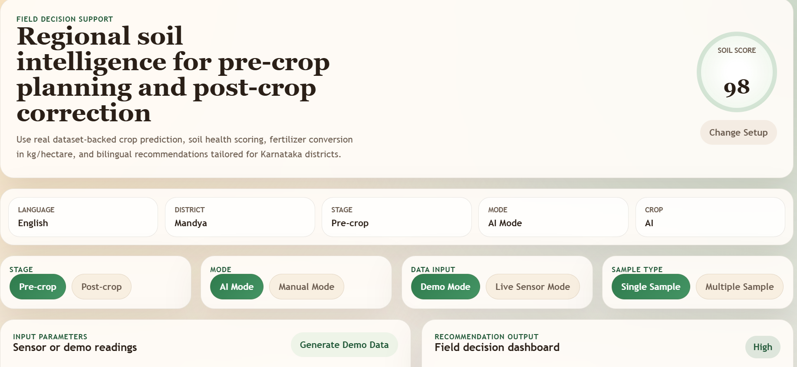
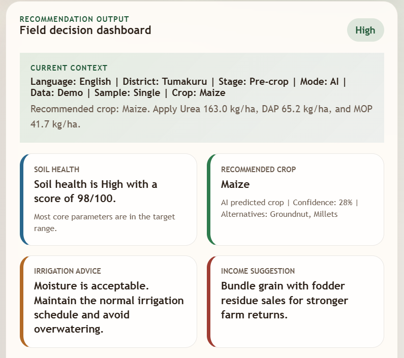
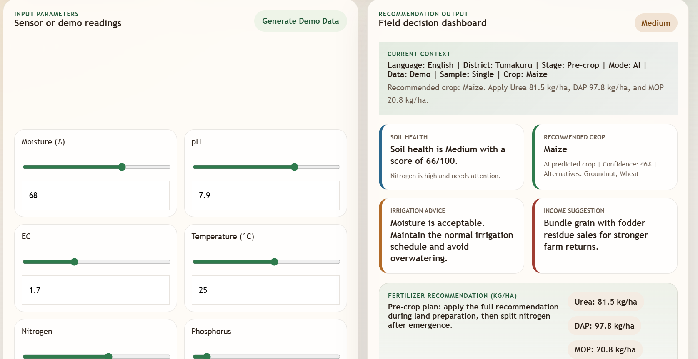

<div align="center">

# Smart Soil Intelligence System

### AI-Powered Precision Agriculture & Soil Analytics Platform

[](https://smart-soil-intelligence.onrender.com/)


###  Transforming Soil Data into Intelligent Farming Decisions
**Live Application:**  
## [⮞ Smart-Soil-Intelligence ⮜](https://smart-soil-intelligence.onrender.com)

</div>

---

# Table of Contents

- [Overview](#-overview)
- [Live Dashboard](#-live-dashboard)
- [Features](#-features)
- [System Architecture](#-system-architecture)
- [Technology Stack](#-technology-stack)
- [Project Structure](#-project-structure)
- [Dashboard Modules](#-dashboard-modules)
- [Machine Learning Pipeline](#-machine-learning-pipeline)
- [Installation](#-installation)
- [Deployment](#-deployment)
- [Applications](#-applications)
- [Future Enhancements](#-future-enhancements)
- [Screenshots](#-screenshots)
- [Author](#-author)

---

# Overview

The **Smart Soil Intelligence System** is an AI-driven precision agriculture platform developed to help farmers, agricultural researchers, and decision-makers analyze soil conditions and obtain actionable farming recommendations.

The platform combines:

- Soil Intelligence
- Machine Learning
- Crop Recommendation
- Fertility Assessment
- Nutrient Analysis
- Precision Agriculture Analytics

to generate meaningful insights that improve crop productivity and soil sustainability.

---

#  Live Dashboard

## Access Dashboard

###  [Open Smart Soil Intelligence Dashboard](https://smart-soil-intelligence.onrender.com)

The deployed dashboard provides:

| Module | Description |
|----------|------------|
| Soil Analysis | Comprehensive soil assessment |
| Soil Health Score | Intelligent soil quality evaluation |
| Crop Recommendation | Suitable crop prediction |
| Nutrient Assessment | NPK analysis |
| Fertilizer Recommendation | Fertility improvement suggestions |
| Agricultural Intelligence | Knowledge-based recommendations |
| Precision Farming Support | Decision support analytics |

---

#  Problem Statement

Farmers often struggle with:

- Improper fertilizer usage
- Low crop productivity
- Lack of soil awareness
- Nutrient imbalance
- Soil degradation
- Inefficient resource utilization

The Smart Soil Intelligence System addresses these challenges using data-driven analysis and AI-assisted recommendations.

---

#  Features

## 🌱 Soil Health Intelligence

- Soil health assessment
- Fertility classification
- Nutrient availability analysis
- Soil condition monitoring

## 🤖 AI-Powered Analysis

- Machine Learning prediction engine
- Intelligent recommendation generation
- Data-driven agricultural insights

## 🌾 Crop Recommendation

Provides crop suggestions based on:

- Soil pH
- Moisture level
- Nutrient status
- Environmental suitability

## 🧪 Nutrient Analysis

Analyzes:

- Nitrogen (N)
- Phosphorus (P)
- Potassium (K)
- Organic Matter
- Soil Conductivity

## 💡 Precision Farming Insights

- Fertilizer recommendations
- Soil improvement strategies
- Yield optimization suggestions
- Sustainable farming guidance

## 📊 Interactive Dashboard

- Modern responsive interface
- Real-time results
- User-friendly workflow
- Clean analytics presentation

---

#  System Architecture

```text
          Smart Soil Intelligence System

 ┌───────────────────────────────────────────────────┐
 │                Farmer/User Input                  │
 └───────────────────────┬───────────────────────────┘
                         │
                         ▼
 ┌───────────────────────────────────────────────────┐
 │              Soil Data Collection                 │
 └───────────────────────┬───────────────────────────┘
                         │
                         ▼
 ┌───────────────────────────────────────────────────┐
 │            Data Processing Layer                  │
 └───────────────────────┬───────────────────────────┘
                         │
                         ▼
 ┌───────────────────────────────────────────────────┐
 │            Machine Learning Engine                │
 └───────────────────────┬───────────────────────────┘
                         │
         ┌───────────────┼───────────────┐
         ▼               ▼               ▼
 ┌─────────────┐ ┌─────────────┐ ┌───────────────┐
 │ Soil Health │ │ Crop Recomm │ │ Fertilizer    │
 │ Assessment  │ │  Prediction │ │ Recommendation│
 └─────────────┘ └─────────────┘ └───────────────┘
         │               │               │
         └───────────────┼───────────────┘
                         ▼
           Precision Farming Report
```

---

#  Dashboard Modules

## 1️⃣ Soil Analysis Dashboard

Provides:

- Soil condition overview
- Nutrient status
- Soil classification
- Health indicators

---

## 2️⃣ Crop Recommendation Engine

Suggests:

- Most suitable crops
- Alternative crops
- Crop compatibility score

---

## 3️⃣ Fertility Assessment Module

Evaluates:

- Soil fertility
- Deficiency indicators
- Soil health rating

---

## 4️⃣ Fertilizer Recommendation Module

Generates:

- Fertilizer suggestions
- Nutrient improvement plans
- Soil enhancement strategies

---

## 5️⃣ Agricultural Knowledge System

Provides:

- Farming guidance
- Best practices
- Soil management recommendations

---

# Technology Stack

## Frontend

- HTML5
- CSS3
- JavaScript

## Backend

- Flask
- Python

## Machine Learning

- Scikit-Learn
- Pandas
- NumPy
- Joblib

## Deployment

- GitHub
- Render

---

# 📂 Project Structure

```text
smart-soil-intelligence/
│
├── app.py
├── model_training.py
├── model_utils.py
├── train_model.py
├── soil_knowledge.py
│
├── requirements.txt
├── Procfile
├── README.md
├── .gitignore
│
├── data/
│   ├── soil_data.csv
│   └── soil_.csv
│
├── models/
│   └── soil_model.pkl
│
├── static/
│   ├── style.css
│   └── script.js
│
├── templates/
│   └── index.html
│
└── screenshots/
```

---

# Machine Learning Pipeline

```text
Dataset Collection
        │
        ▼
Data Cleaning
        │
        ▼
Feature Engineering
        │
        ▼
Training Dataset
        │
        ▼
Model Training
        │
        ▼
Model Validation
        │
        ▼
Model Storage (.pkl)
        │
        ▼
Prediction Engine
        │
        ▼
Dashboard Output
```

---

# Input Parameters

| Parameter | Description |
|------------|-------------|
| pH | Soil Acidity/Alkalinity |
| Moisture | Soil Water Content |
| Temperature | Soil Temperature |
| Nitrogen | Plant Growth Nutrient |
| Phosphorus | Root Development Nutrient |
| Potassium | Plant Health Nutrient |
| EC | Electrical Conductivity |
| Organic Matter | Fertility Indicator |

---

# System Output

The platform generates:

* [x] Soil Health Status

* [x] Soil Fertility Assessment

* [x] Nutrient Analysis

* [x] Crop Recommendation

* [x] Fertilizer Suggestion

* [x] Soil Improvement Guidance

* [x] Precision Farming Insights

---

# ⚙️ Installation

## Clone Repository

```bash
git clone https://github.com/YOUR_USERNAME/smart-soil-intelligence.git

cd smart-soil-intelligence
```

## Create Virtual Environment

### Windows

```bash
python -m venv venv

venv\Scripts\activate
```

### Linux/Mac

```bash
python3 -m venv venv

source venv/bin/activate
```

## Install Dependencies

```bash
pip install -r requirements.txt
```

## Run Application

```bash
python app.py
```

Open:

```text
http://127.0.0.1:5000
```

---

# 🌐 Deployment

## Render Deployment

### Build Command

```bash
pip install -r requirements.txt
```

### Start Command

```bash
gunicorn app:app
```

### Live Dashboard

👉(https://smart-soil-intelligence.onrender.com)

---

# 🌾 Applications

## Precision Agriculture

- Smart farming
- Soil monitoring
- Yield optimization

## Agricultural Research

- Soil analytics
- Data-driven agriculture

## Farmer Support Systems

- Crop planning
- Nutrient management

## Sustainable Agriculture

- Reduced fertilizer wastage
- Improved soil conservation

---

# Future Enhancements

- ESP32 Integration
- RS485 Soil Sensor Support
- IoT Dashboard
- Weather Forecast Integration
- AI Disease Prediction
- Satellite Data Analytics
- Mobile Application
- Cloud Analytics
- Multi-Language Support
- Real-Time Monitoring

---

#  Screenshots

## Dashboard Home

<p align="center">
  
</p>

## Soil Analysis Results


<p align="center">
  
</p>

## Crop Recommendation

Add screenshot:

<p align="center">
  
</p>

---

# Academic Relevance

This project covers:

- Machine Learning
- Artificial Intelligence
- Precision Agriculture
- Data Analytics
- Agricultural Informatics
- Smart Farming Technologies

Suitable for:

- Final Year Engineering Projects
- Research Projects
- Smart Agriculture Applications
- Agricultural Technology Demonstrations
- Hackathons

---

# 👨‍💻 Author

[SUJAN G S](https://github.com/OjasFlux)
Electronics & Communication Engineering (ECE)

### Areas of Interest

- Embedded Systems
- Artificial Intelligence
- Machine Learning
- IoT Systems
- Precision Agriculture

### GitHub

https://github.com/OjasFlux

---
# SOFTWARE DEVELOPER 
[PRAJWAL B U](https://github.com/prajwalchitte46)
Electronics & Communication Engineering (ECE)

### Areas of Interest

- Embedded Systems
- Artificial Intelligence
- Machine Learning
- IoT Systems
- Precision Agriculture

### GitHub

https://github.com/prajwalchitte46

---

# Support the Project

If you find this project useful:

⭐ Star the Repository

🍴 Fork the Repository

📢 Share the Project

🚀 Explore the Live Dashboard

---

# 📜 License

MIT License

Copyright (c) 2026

---

<div align="center">

##  Smart Soil Intelligence System

### Intelligent Soil Analytics for Smarter Farming

** Live Dashboard:**
https://smart-soil-intelligence.onrender.com
</div>
